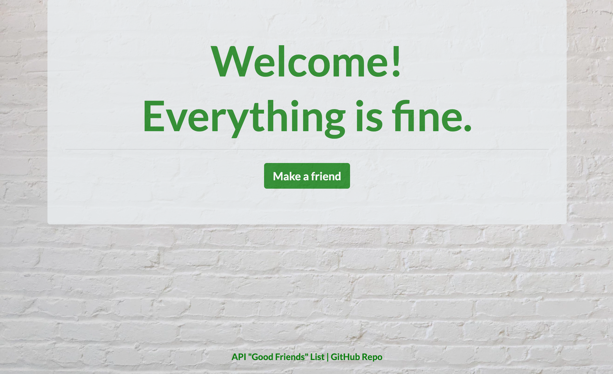
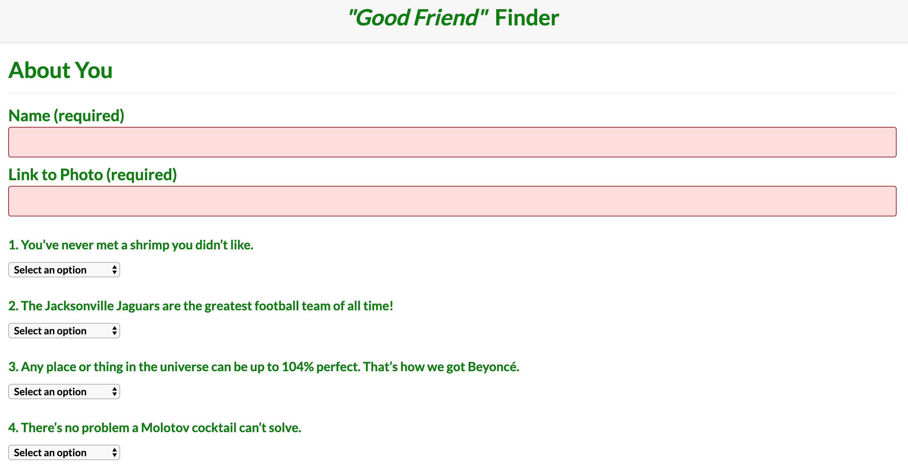
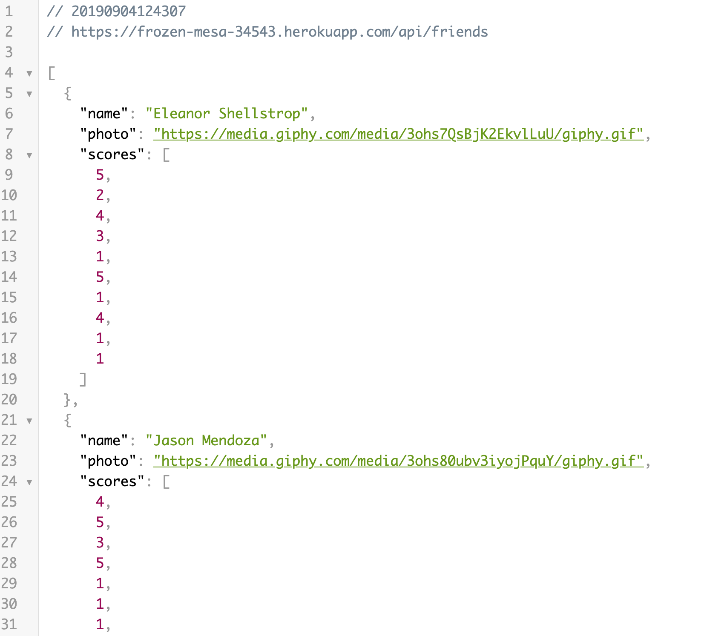
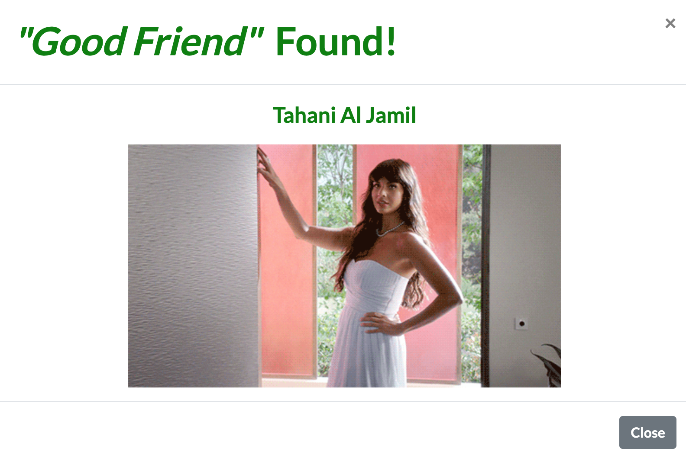

# Friend Finder

## About

Friend Finder is a full-stack application that matches users to a character from NBC's "The Good Place" based on survey results. Node.js & an Express server on the back-end handle routing and connect to the "friends" API, which stores the character data. HTML & CSS(with a Bootstrap framework) display the landing page, survey, and user's match (via a modal pop-up) on the front-end. The application is deployed to Heroku.  

## Technologies Used

- Git
- GitHub
- HTML
- CSS
- Bootstrap 
- JavaScript
- jQuery 
- Node.js
- Express.js
- Heroku 

## How to Use It

Check out the live site [here](https://frozen-mesa-34543.herokuapp.com/). 

Click the "Make a Friend" button on the landing page and then submit your name, a link to a photo, and your responses to the 10 survey questions. The application's algorithm will match you to the character from "The Good Place" whose answers are closest to yours. 

### Landing Page

### Survey

### Character data stored in "Friends" API 

### Match displayed with modal pop-up 

